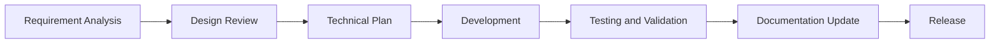

# 🎯 WriteFlow Feature Documents

Welcome to the WriteFlow Feature Documentation Center. Here, you will find detailed records of the requirements, design, implementation, and testing plans for each feature.

## 📚 Feature Document List

### [Slidev PPT Creation Feature](./slidev-ppt-feature.md) 🆕
**An AI-driven presentation creation system**

#### Core Capabilities
- 🎨 **Intelligent Creation**: AI generates complete presentations based on a topic.
- 🔄 **Article Conversion**: Intelligently converts Markdown articles into PPTs.
- 📝 **Outline Generation**: Automatically generates a structured presentation outline.
- ✨ **Content Optimization**: AI optimizes presentation content and visual effects.

#### Technical Features
- Based on the Slidev framework.
- Supports Markdown syntax.
- A rich selection of theme templates.
- Real-time preview functionality.

## 🚀 Upcoming Features

### Multimodal Content Support
- **Chart Generation**: AI automatically generates data visualization charts.
- **Image Processing**: Intelligent image cropping and optimization.
- **Video Embedding**: Supports the integration of video content.

### Collaboration Features
- **Team Collaboration**: Real-time collaborative editing for multiple users.
- **Version Control**: A complete history of versions.
- **Comment System**: Content review and feedback.

### AI-Enhanced Features
- **Intelligent Continuation**: Automatically continues writing based on context.
- **Style Transfer**: One-click conversion of writing style.
- **Content Summarization**: Automatically generates summaries of various lengths.

## 📊 Feature Categories

### Writing Assistance Features
| Feature         | Status    | Priority | Document                               |
| --------------- | --------- | -------- | -------------------------------------- |
| Slidev PPT      | ✅ Completed | P0       | [View Document](./slidev-ppt-feature.md) |
| Outline Generation | ✅ Completed | P0       | Built-in feature                       |
| Content Rewriting | ✅ Completed | P0       | Built-in feature                       |
| Grammar Check   | ✅ Completed | P1       | Built-in feature                       |

### Research Features
| Feature        | Status      | Priority | Description                    |
| -------------- | ----------- | -------- | ------------------------------ |
| Web Search     | ✅ Completed | P0       | In-depth topic research        |
| Fact-Checking  | 🔄 In-Progress | P1       | Information accuracy verification |
| Citation Management | 📋 Planned   | P2       | Bibliography management        |

### Publishing Features
| Feature           | Status    | Priority | Description               |
| ----------------- | --------- | -------- | ------------------------- |
| Multi-Platform Publishing | ✅ Completed | P0       | Supports various formats  |
| WeChat Formatting | ✅ Completed | P1       | Official Account optimization |
| SEO Optimization  | 📋 Planned   | P2       | Search engine optimization |

## 📝 Feature Requirement Document Template

Each feature document should include the following sections:

### 1. Feature Overview
- Feature name and version
- Feature description
- Target users
- Use cases

### 2. Requirement Analysis
- User requirements
- Business requirements
- Technical requirements
- Non-functional requirements

### 3. Design Plan
- Architectural design
- Interface design
- Data model
- Interaction flow

### 4. Implementation Plan
- Development phases
- Timeline
- Resource requirements
- Risk assessment

### 5. Testing Plan
- Testing strategy
- Test cases
- Acceptance criteria
- Performance metrics

## 🔄 Feature Development Process

### Phase Descriptions

1. **Requirement Analysis**: Collect user feedback and analyze feature requirements.
2. **Design Review**: Review the feature design and determine the technical plan.
3. **Technical Plan**: Formulate a detailed technical implementation plan.
4. **Development**: Develop the feature according to the plan.
5. **Testing and Validation**: Comprehensively test the correctness of the feature.
6. **Documentation Update**: Update user and technical documentation.
7. **Release**: Release the feature and notify users.

## 🎯 Priority Definitions

### P0 - Core Features
- Core value of the product
- Essential features for users
- Affects basic usability

### P1 - Important Features
- Enhances user experience
- Improvements to commonly used features
- Competitive features

### P2 - Value-Added Features
- "Nice-to-have" features
- Niche use case requirements
- Future extension features

## 📈 Feature Maturity

### Level 1: MVP
- Basic functionality is available.
- The core workflow is complete.
- Basic testing has passed.

### Level 2: Beta
- The feature is mostly complete.
- User testing has passed.
- Performance is generally acceptable.

### Level 3: GA
- The feature is fully mature.
- Stable in a production environment.
- Documentation is complete and comprehensive.

## 🔍 Feature Evaluation Metrics

### Usage Metrics
- Daily active users
- Feature usage frequency
- User retention rate

### Performance Metrics
- Response time
- Processing speed
- Resource consumption

### Quality Metrics
- Error rate
- User satisfaction
- Issue resolution rate

## 🤝 Contributing New Features

### Proposal Process
1. Propose a feature suggestion in GitHub Issues.
2. Participate in community discussions.
3. Submit a feature design document.
4. Get feedback from the community.

### Development Process
1. Fork the project repository.
2. Create a feature branch.
3. Implement the feature code.
4. Submit a Pull Request.
5. Code review.
6. Merge and release.

## 📚 Related Resources

### Development Guides
- [System Architecture](../architecture/system-architecture.md)
- [Technical Implementation](../architecture/technical-implementation.md)
- [Tool System](../architecture/writing-tools.md)

### User Guides
- [Quick Start](../guides/quick-start.md)
- [Slash Commands](../guides/slash-commands.md)
- [Slidev Guide](../guides/slidev-ppt-guide.md)

### External Links
- [GitHub Repository](https://github.com/writeflow/writeflow)
- [Issue Tracker](https://github.com/writeflow/writeflow/issues)
- [Discussion Community](https://github.com/writeflow/writeflow/discussions)

---

*Last updated: 2025-01-03*
*WriteFlow Feature Team*
